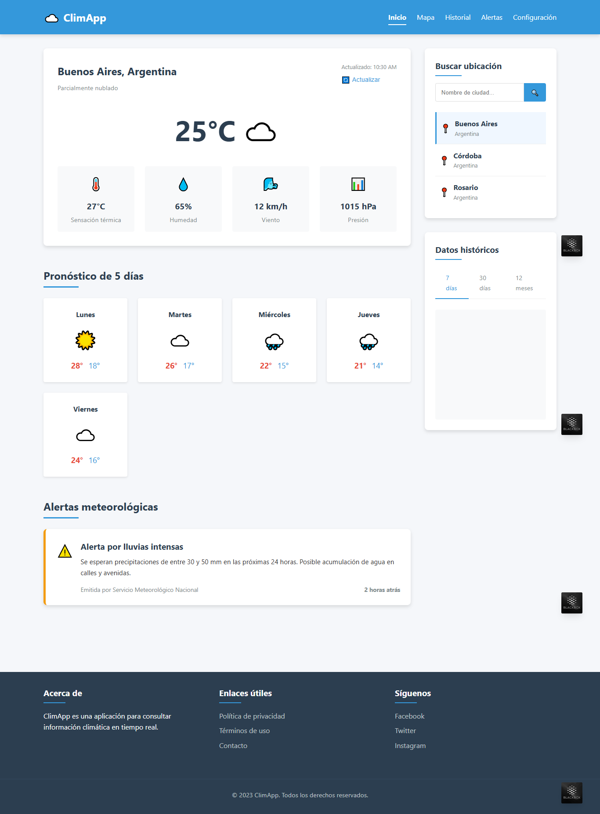

## 🖼️ Vista previa de la aplicación

---

## 📋 Trabajo Práctico N.º 1  
**Asignatura:** Metodología de Sistemas I  
**Nivel:** Segundo año – Primer cuatrimestre  
**Carrera:** Tecnicatura Universitaria en Programación  
**Comisión:** 2.2  

### 👨‍🏫 Docente
**Nombre y Apellido:** Facundo Leonel Veron  
**E-mail de contacto:** faccu.veron92@gmail.com  

### 👨‍🎓 Alumno
**Nombre:** Gerardo Medina Villalba  

### 👩‍💼 Coordinadora de la Carrera
**Nombre:** Ing. Claudia Laclau  
**E-mail:** tup@frre.utn.edu.ar  
**Web:** [www.frre.utn.edu.ar/tup](http://www.frre.utn.edu.ar/tup)

---
## ✅ Recomendaciones de Mejora

##📅 CAMBIOS REALIZADOS - 10/04/2025

✅ Se agregó un bloque de comentario en el HTML principal documentando buenas prácticas y sugerencias de mejora.

✅ Se revisó y confirmó el uso de ` justo antes de cerrar el `</body>` para que el sitio cargue más rápido.

---

### 🚫 8. No preparar tu sitio para crecer
- ❌ **Mala práctica:** Pensar solo en cómo funciona hoy.
- ✅ **Consejo:** Usá atributos como `data-*`, etiquetas semánticas, y estructura bien tu código para que sea fácil de escalar y mantener.

---

### 🚫 9. No agregar detalles importantes del proyecto
- ❌ **Mala práctica:** No incluir `favicon`, `meta` etiquetas o una descripción del proyecto.
- ✅ **Consejo:** Dale identidad a tu proyecto desde el principio. Eso mejora la experiencia del usuario y la visibilidad en buscadores.

---
📌 *Este documento acompaña al Trabajo Práctico N.º 1 de la materia Metodología de Sistemas I para la presentación académica de la aplicación ClimApp.*

